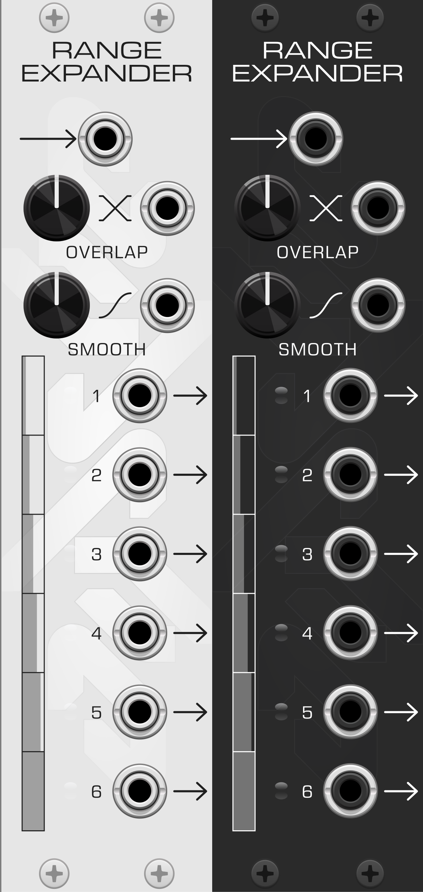

# Range Expander

A utility module for [VCV Rack](https://vcvrack.com/) that subdivides a unipolar signal into a series of full-range output signals.



## What it does

Patch a 0–10V signal into the input, and Range Expander splits its range across every connected output. Each output watches its own slice of the input range and rescales that slice to a full 0–10V sweep:

- With **2 outputs** connected: output 1 sweeps 0–10V while the input travels 0–5V, then output 2 sweeps 0–10V while the input travels 5–10V.
- With **6 outputs** connected: each output covers one sixth of the input range.

Outputs are assigned top to bottom, and only *connected* outputs count — the module automatically re-divides the range as you patch and unpatch cables. Below its slice an output rests at 0V; above it, it holds at 10V.

The name says it: one modulation source becomes a sequence of full-range gestures. A single slow LFO sweep can open six filters one after another. A ramp becomes a cascade. A macro knob becomes a scene controller.

## Controls

| Control | Function |
|---|---|
| **In** | The unipolar (0–10V) signal to subdivide. |
| **Overlap** | Widens each output's slice so neighboring ranges overlap and hand off gradually instead of meeting at hard boundaries. At 100%, every output spans the full input range. CV-controllable (0–10V). |
| **Smooth** | Morphs each output's response from linear to a smootherstep curve, easing the entry and exit of each slice. CV-controllable (0–10V). |
| **Out 1–6** | The subdivided outputs, each rescaled to 0–10V. The light next to each output shows its current level. |

CV inputs take priority over their knobs when connected.

## Patch ideas

- **Sequential filter sweep** — one slow LFO into In, outputs 1–4 into four filter cutoffs. The filters open in sequence as the LFO rises.
- **Macro control** — a single knob (or fader) recorded into In becomes a scene morph: each output brings in one voice/effect as you turn.
- **Cascading envelopes** — a long envelope into In turns into staggered per-voice articulation.
- **Overlap as crossfade** — with overlap up, adjacent outputs hand off gradually; use pairs to crossfade between modulation destinations.

## Bypass behavior

When the module is bypassed, the input is routed directly to all outputs.

## Building from source

This is a standard Rack plugin, built with the [Rack SDK](https://vcvrack.com/manual/Building). Download the SDK for your platform — note that macOS ships a separate SDK per CPU architecture:

- [Mac ARM64](https://vcvrack.com/downloads/Rack-SDK-latest-mac-arm64.zip) (Apple silicon) · [Mac x64](https://vcvrack.com/downloads/Rack-SDK-latest-mac-x64.zip) (Intel)
- [Windows x64](https://vcvrack.com/downloads/Rack-SDK-latest-win-x64.zip) · [Linux x64](https://vcvrack.com/downloads/Rack-SDK-latest-lin-x64.zip)

Unzip it, then tell the Makefile where it is:

```sh
export RACK_DIR=/absolute/path/to/Rack-SDK
```

Alternatively, unzip it as a sibling of this repo (`../Rack-SDK`) — that's the Makefile's default, so no environment setup is needed.

```sh
make          # compile plugin.dylib (or .so / .dll)
make dist     # package a distributable .vcvplugin
make install  # build, package, and install into your Rack user folder
```

`make install` is the quickest way to try the module: restart Rack afterward and it appears under the judyIO brand.

## License

Source code licensed under [GPL-3.0-or-later](LICENSE).
Panel graphics © Clinton Judy.
